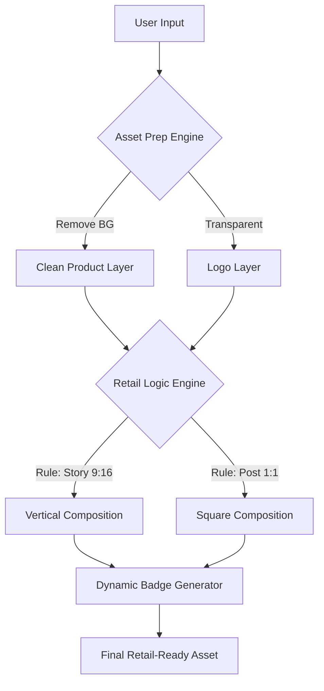

# 🎯 CREO AI: Logic-Driven Creative Engine

**CREO AI** is a specialized design automation platform that replaces manual resizing and layout guesswork with **Retail-Correct Logic**. Unlike generic AI image generators that create unpredictable "art," CREO AI   functions as a digital senior designer—enforcing brand rules, visual hierarchy, and format-aware composition for market-ready assets.

---

## 🚫 The Problem
In modern retail, brands don't struggle to *imagine* an ad; they struggle to *scale* it.
* **Manual Drudgery:** Designers waste 80% of their time copy-pasting logos and re-aligning text for 20+ different formats.
* **Diffusion Chaos:** Tools like Midjourney or DALL-E generate "dreamy" layouts that ignore brand safety, overlap logos, and hallucinate text.
* **The "Unsafe" Ad:** Generic AI doesn't understand that a badge should never cover a product's face or that a CTA needs specific contrast ratios.
* **The "Unsafe" Ad:** Generic AI doesn't understand that a badge should never cover a product's face or that a CTA needs specific contrast ratios.


## ✅ The Solution: Logic, Not Magic
CREO AI uses a **"Decision-First"** architecture. It doesn't "dream" pixels; it places assets based on professional retail design principles.

### The 5-Step Automated Pipeline:
1. **Intent Capture:** User provides raw ingredients (Product PNG, Logo, Headline, CTA text).
2. **Asset Preparation:** Automatic background removal and logo cleaning to ensure transparency.
3. **Format Awareness:** The system detects the target aspect ratio (1:1 Feed, 9:16 Story, 16:9 Banner).
4. **Layout Enforcement:** Elements are locked into a professional hierarchy (Headline > Subheadline > CTA Badge).
5. **Badge Generation:** A high-contrast, retail-safe CTA "sticker" is dynamically generated and placed in a clear visual zone.
6. **Export:** The final asset is exported in a format that is ready for use in social media, email, or other marketing channels.
7. **Delivery:** The final asset is delivered to the user in a format that is ready for use in social media, email, or other marketing channels.
8. **Analytics:** The final asset is delivered to the user in a format that is ready for use in social media, email, or other marketing channels.
9. **Feedback:** The final asset is delivered to the user in a format that is ready for use in social media, email, or other marketing channels.
10. **Optimization:** The final asset is delivered to the user in a format that is ready for use in social media, email, or other marketing channels.

---

## 🏗️ Technical Architecture



---

## 💎 Core Features

| Feature | How It Works | Why It Wins |
| --- | --- | --- |
| **Retail Hierarchy Lock** | Forces Headline > Subhead > CTA order. | Ensures the customer reads the message. |
| **Asset Preservation** | Does NOT alter the product pixels. | Essential for brand compliance and legal. |
| **Dynamic Badge Gen** | Creates high-contrast rounded/pill CTAs. | Mimics professional FMCG/Retail ads. |
| **Zero-Overlap Guard** | Coordinates logo/text placement zones. | Prevents messy, "unprofessional" designs. |
| **Smart Layering** | Treats images as PNG layers, not flat pixels. | Allows for clean, high-res exports. |

---

## 🚀 Getting Started

### Prerequisites

* Node.js v18+
* Python 3.9+ (for background removal processing)
* Docker

### Installation

```bash
git clone [https://github.com/your-username/retail-gen-ai.git](https://github.com/your-username/retail-gen-ai.git)
cd retail-gen-ai
npm install

```

### Configuration

Define your brand DNA in `brand_rules.json`:

```json
{
  "brandName": "RetailBrandX",
  "preferredPlacements": {
    "logo": "top-right",
    "badge": "bottom-left"
  },
  "typography": {
    "headlineFont": "Inter-Bold",
    "ctaColor": "#E60000"
  },
  "brandRules": {
    "logo": {
      "primaryColor": "#E60000",
      "secondaryColor": "#E60000",
      "font": "Inter-Bold",
      "ctaFont": "Inter-Bold",
      "logoPosition": "top-right",
      "productScale": 0.55
    }
  }
}

```

---

## 🚦 Design Logic (The "Brain")

The system follows a strict "Grid & Zone" logic:

* **The Anchor:** The product is the visual hero, occupying 60% of the visual weight.
* **The Safe Zone:** Logos are placed in 1 of 4 corners, verified against the background complexity.
* **The Retail Badge:** Instead of plain text, the CTA is wrapped in a "Badge" (circle or pill) with a thick stroke to ensure it pops against any product image.
* **The Retail Badge:** Instead of plain text, the CTA is wrapped in a "Badge" (circle or pill) with a thick stroke to ensure it pops against any product image.


---

## 📈 Business Impact

* **10x Faster Turnaround:** Campaign scaling that took days now takes seconds.
* **Operational Efficiency:** Moves design from "creative exploration" to "operational execution."
* **Global Consistency:** Every ad, in every format, looks like it was made by the same designer.


---

## 📄 License

This project is licensed under the MIT License.
```

```