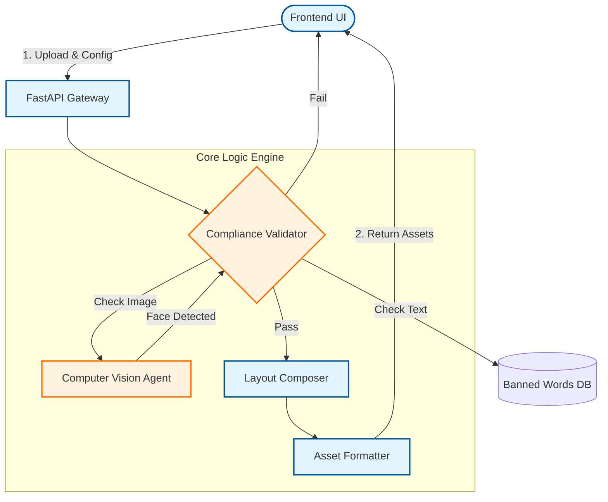

# 🎨 AI Retail Creative Studio

**Strict Compliance Generation Engine for Enterprise Retail Assets**

[](https://reactjs.org/)
[](https://fastapi.tiangolo.com/)
[](https://www.docker.com/)
[](https://www.python.org/)
[](https://opensource.org/licenses/MIT)

---

The **AI Retail Creative Studio** is a state-of-the-art automated design system built to generate localized, brand-compliant retail marketing assets at scale.

Unlike standard generative tools, this system is built on a **"Compliance-First" architecture** that strictly enforces brand guidelines, legal requirements, and layout safety zones *before* any content is created.

---

## Key Features

### 🛡️ Strict Compliance Engine
*   **Zero Tolerance Policy**: Hard-coded rejection of forbidden content (Financial claims, Competitions, Sustainability assertions).
*   **Alcohol & Age Gating**: Semantic analysis automatically detects alcohol-related copy and injects mandatory, high-contrast "Drinkaware" lock-ups.
*   **Accessibility Gates**: Enforces WCAG AA contrast ratios and minimum font sizes:
    *   20px for Brand Copy
    *   12px for Terms & Conditions
    *   10px for Checkout details

### 🎨 Dynamic Template System
*   **LEP Mode (Low Everyday Price)**: A restrictive template enforcing white backgrounds, specific brand typography, and rigid layout rules.
*   **Social Safe Zones**: Enforces 9:16 "Stories" formatting with 200px Top / 250px Bottom exclusion zones.
*   **Value Tiles**: Immutable, schema-driven components (e.g., "New", "Clubcard Price", "White Value Tile") that resist tampering.

### 👁️ Computer Vision Integration
*   **People Detection**: OpenCV-based filtering scans product imagery for human faces.
*   **Verification Loop**: Triggers a "Confirmation Required" workflow if talent is detected, ensuring usage rights compliance.

### 📐 Geometric Layout Solver
*   **Collision Avoidance**: Physics-based layout ensures Packshots, Logos, and CTAs never overlap text or safe zones.
*   **Visual Priority**: Mathematical enforcement of visual hierarchy (e.g., "Packshot must remain the closest element to the CTA").

---

## 🏗️ Architecture

The solution uses a decoupled **React + FastAPI** architecture, containerized for rapid deployment.



### 🔄 Data Flow Protocol
1.  **Ingestion**: User uploads raw assets via the **React Frontend**.
2.  **Validation Gate**: The **FastAPI** backend runs the `Compliance Validator` against strict rules (No faces, no banned words).
3.  **Visual Processing**: The **Computer Vision Agent** (OpenCV) scans images for human presence.
4.  **Composition**: If compliant, the **Composer** solves the layout geometry using physics-based collision detection.
5.  **Delivery**: Assets are formatted and returned to the client as specific retail variants (Story, Feed, Landscape).

| Component | Tech Stack | Description |
| :--- | :--- | :--- |
| **Backend** | Python, FastAPI, Pillow, OpenCV | Core layout rendering and compliane logic. |
| **Frontend** | React, Vite | Main creative interface and documentation portal. |
| **Orchestration** | Docker Compose | Unified service deployment. |

---

## 🛠️ Installation & Deployment

### Prerequisites
*   **Docker & Docker Compose** (Recommended)
*   *Alternatively*: Python 3.10+ & Node.js 18+

### 🐳 Docker Deployment (Recommended)
Spin up both the Backend API and Frontend Client in isolated containers with a single command.

```bash
# 1. Clone the repository
git clone https://github.com/madhesh60/CREO-for-retail

# 2. Build and Run
docker-compose up --build
```

*   **Frontend**: `http://localhost:3000`
*   **Backend Docs**: `http://localhost:8000/docs`

### 💻 Local Development
If you prefer running the services locally without Docker:

**Backend Setup**
```bash
cd backend
pip install -r req.txt
# Start the server with hot-reloading
python -m uvicorn main:app --reload
```

**Frontend Setup**
```bash
cd frontend
npm install
# Start the development server
npm run dev
```

---

## 📖 Usage Guide

1.  **Ingest**: Upload a high-res Product Packshot and Brand Logo. The system automatically removes the product background.
2.  **Configure**:
    *   **Headline/Subhead**: Enter your localized copy.
    *   **Template**: Choose 'Standard' or 'LEP' (Low Everyday Price).
    *   **Tiles**: Optionally add 'New' or 'Clubcard' value tiles.
3.  **Validate**: Click "Generate". The system runs `validator.py` to check:
    *   *Copy*: Banned keywords (e.g., "best", "win", "green").
    *   *Image*: Presence of people (requires manual confirmation).
    *   *Structure*: Mandatory headline/subhead presence.
4.  **Result**: If compliant, the system generates assets in multiple formats:
    *   📱 **9:16** (Story)
    *   🟦 **1:1** (Feed)
    *   📺 **16:9** (Landscape)
---

